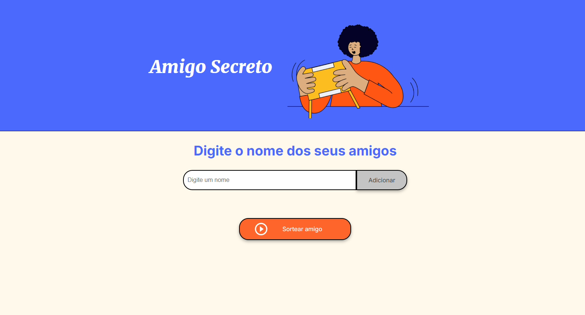
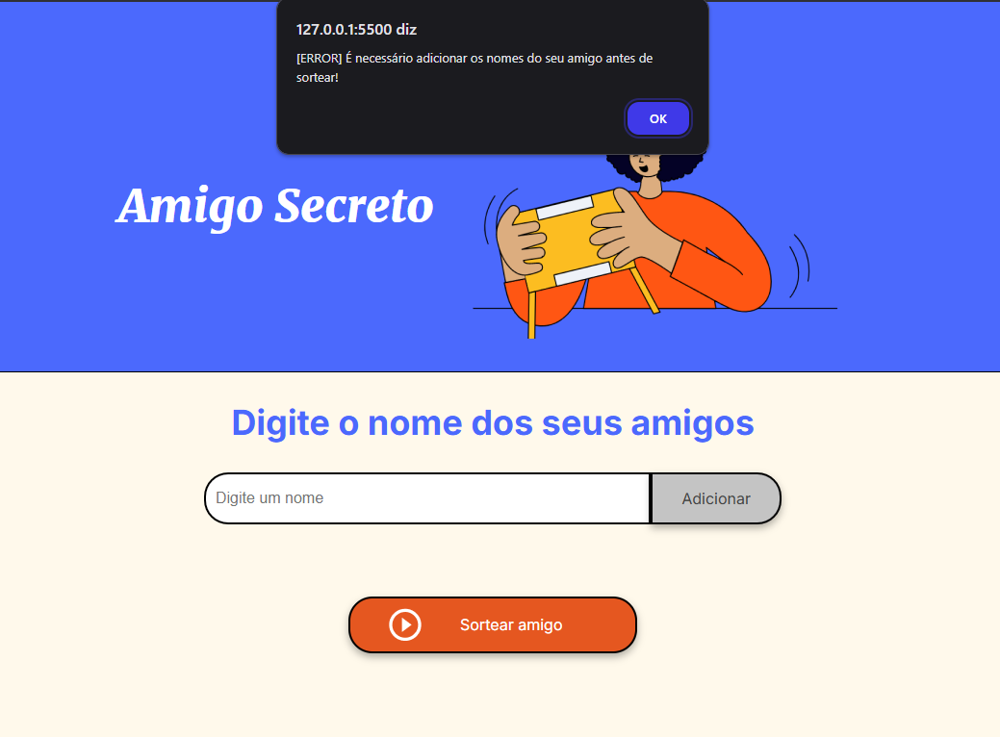

# Challenge amigo secreto ONE

A funcionalidade deste projeto é conseguir adicionar vários amigos e realizar um sorteio entre eles para decidir quem será o amigo secreto.

Temos também algumas validações no momento de adicionar o amigo.

### Tecnologias utilizadas para realizar o projeto.

 
 
 

